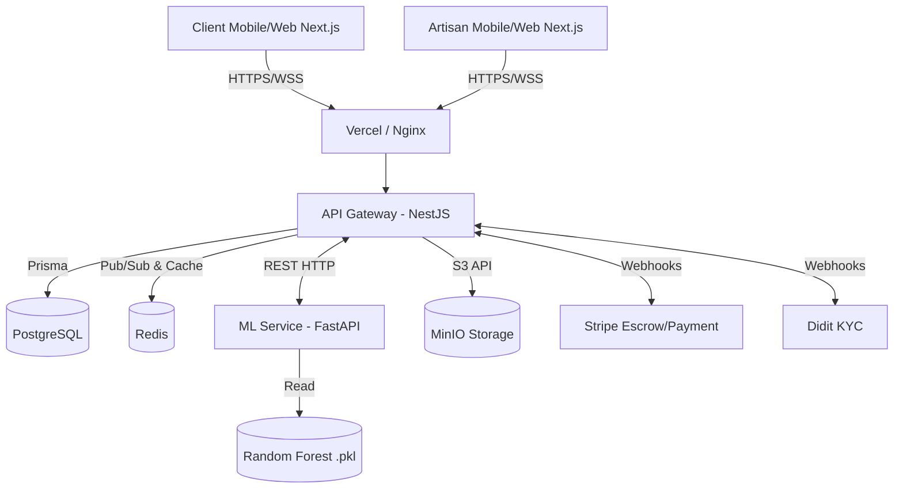

# ARTISAN-237 V2 — EXECUTION BLUEPRINT

Ce document est le plan d'exécution technique définitif pour l'implémentation de la version cible. Il sert de spécification stricte pour les développeurs et agents IA.

---

## PARTIE 1 — ARCHITECTURE CIBLE FINALE

### Diagramme de Flux



### Responsabilités
*   **Frontend (Next.js 15)** : Rendu SSR/SSG pour le SEO public (profils artisans). SPA via `app` router pour les dashboards. PWA via Service Workers pour le offline support et le cache.
*   **Backend (NestJS 10)** : Cœur transactionnel. API REST sécurisée par JWT. WebSockets via Socket.io pour le chat. Gestion métier (Jobs, Quotes, Escrow, Litiges).
*   **IA (FastAPI)** : Microservice d'inférence (stateless). Ne fait que recevoir des vecteurs, exécuter l'arbre de décision (`.pkl`), et renvoyer le score et son explication.
*   **PostgreSQL** : Seule source de vérité pour les entités relationnelles.
*   **Redis** : Gestion des sessions Websocket (adapter NestJS), rate limiting, et cache court-terme des appels IA.
*   **MinIO** : Object storage des pièces jointes (vidéos de litiges, photos avant/après, avatars).

---

## PARTIE 2 — STRUCTURE FINALE DU MONOREPO

```text
ARTISAN-237/
├── apps/
│   ├── api/                   # Backend NestJS (inchangé, à stabiliser)
│   ├── web/                   # Frontend Next.js 15 (PWA)
│   └── ml-service/            # IA Microservice FastAPI (à créer)
├── packages/
│   ├── config/                # Configurations partagées (ESLint, TS)
│   ├── database/              # Schema Prisma et migrations
│   ├── shared-types/          # Contrats DTO/Interfaces TS partagés Front/Back
│   └── ui/                    # Composants Radix/Tailwind réutilisables (shadcn-like)
├── docker/
│   ├── db/                    # Scripts init PostgreSQL
│   └── minio/                 # Policies S3
├── docs/                      # Documentation / Blueprint
└── .github/workflows/         # CI/CD Actions
```
*Convention* : Strict monorepo. Tout le code front et back partage les interfaces de `packages/shared-types` pour garantir la synchronisation du schéma.

---

## PARTIE 3 — BLUEPRINT BACKEND NESTJS

### Modules existants et évolution
1.  **`AuthModule`, `UsersModule`** : Inchangés (JWT/RBAC fonctionnel).
2.  **`TaxonomiesModule`, `ReviewsModule`** : Inchangés.
3.  **`JobsModule`** : Évolue pour appeler le `AiGatewayModule` lors de la publication d'un Job pour identifier les "Top Matchs".
4.  **`QuotesModule`** : Inchangé, gère les devis.
5.  **`FinancialModule`** : Évolue. Implémenter strictement l'interface Stripe Connect pour le modèle Escrow (Hold funds & Release).
6.  **`ChatModule`, `NotificationsModule`** : Inchangés (Socket.io).
7.  **`DisputesModule`** : Inchangé.
8.  **`AiGatewayModule`** : **REFONTE CRITIQUE**. Doit passer d'un mock à un client HTTP (`@nestjs/axios`) interrogeant le nouveau `ml-service`.
9.  **`ArtisansModule`** : Évolue pour calculer et exposer le `TrustScore`.

### Nouveau Module : `TrustEngineModule`
*   **Responsabilité** : Calcul et mise en cache des scores de confiance, fiabilité et réactivité. Cron Jobs nocturnes pour les mises à jour asynchrones.

---

## PARTIE 4 — BLUEPRINT IA (FastAPI)

Transformation du Jupyter Notebook en véritable API d'inférence.

### Structure `apps/ml-service/`
```text
ml-service/
├── app/
│   ├── main.py                # Point d'entrée FastAPI
│   ├── api/
│   │   └── router.py          # Définition des endpoints
│   ├── core/
│   │   └── config.py          # Settings Pydantic
│   ├── models/
│   │   ├── schemas.py         # Schémas Pydantic (Request/Response)
│   │   └── random_forest.py   # Wrapper classe chargeant les .pkl
│   └── services/
│       └── explainability.py  # Algorithme de XAI (génération texte)
├── data/                      # .pkl existants (encodeurs, modèle)
├── requirements.txt
└── Dockerfile                 # Image Python 3.11 slim
```

### Endpoints (Contrats Pydantic)
**1. `POST /predict/match`**
*   **Payload** : `MatchRequest` (`client_need`: dict, `artisan_profile`: dict)
*   **Réponse** : `MatchResponse` (`score`: float, `confidence`: float)

**2. `POST /predict/mass-match`**
*   **Payload** : `MassMatchRequest` (`client_need`: dict, `artisans`: list[dict])
*   **Réponse** : `MassMatchResponse` (`results`: list[{`artisan_id`, `score`}])

**3. `POST /explain`** (Nouveau)
*   **Payload** : `ExplainRequest` (`score`, `artisan_features`)
*   **Réponse** : `ExplainResponse` (`explanations`: list[str], `human_text`: str)
    *   *Exemple human_text* : "Correspondance excellente (92%). Artisan expert dans votre quartier avec un temps de réponse de 5 min."

---

## PARTIE 5 — TRUST ENGINE (Spécification)

Intégré dans le `TrustEngineModule` du backend NestJS.

### 1. Verification Score (VS)
*   **Formule** : `(is_kyc_verified * 60) + (is_email_verified * 20) + (is_phone_verified * 20)`
*   **Résultat** : 0 à 100. Un VS de 100 donne le badge "Profil Vérifié".

### 2. Reliability Score (RS)
*   **Données** : `$jobs_completed`, `$jobs_cancelled`, `$rating`.
*   **Formule** : `(( $jobs_completed / ($jobs_completed + $jobs_cancelled) ) * 50) + (($rating / 5) * 50)`
*   **Fréquence** : Calculé à chaque changement de statut de Job.

### 3. Responsiveness Score (RPS)
*   **Données** : Différence `Quote.createdAt` - `Job.createdAt`.
*   **Formule** : Classification. < 15 min = "Ultra-rapide", < 2h = "Rapide", > 1 jour = "Lent".

### 4. Overall Trust Score
*   **Calcul** : `(VS * 0.4) + (RS * 0.6)`. Affiché publiquement sur la carte Artisan.

---

## PARTIE 6 — SMART JOB BUILDER (IA Générative Future)

Ce module permet de traduire un langage naturel en payload structuré pour la DB. (À implémenter via API OpenAI gpt-4o-mini ou Claude Haiku).

*   **Flux** : Le client tape "L'eau coule sous mon évier de cuisine, c'est urgent" au lieu de remplir 5 champs.
*   **Intégration NestJS** : Endpoint `POST /jobs/smart-build`.
*   **Prompt LLM (System)** : 
    ```text
    Tu es l'assistant ARTISAN-237. Analyse la demande du client et extrais un JSON strict:
    { "categoryId": "<uuid ou slug>", "urgency": "LOW|MEDIUM|HIGH", "title": "...", "structuredDescription": "..." }
    Les métiers possibles sont : Plomberie, Electricité, Maçonnerie, Froid.
    ```
*   **Sortie** : 
    ```json
    {
      "categoryId": "plomberie",
      "urgency": "HIGH",
      "title": "Fuite d'eau sous évier de cuisine",
      "structuredDescription": "Fuite active constatée sous l'évier. Nécessite une intervention rapide."
    }
    ```

---

## PARTIE 7 — API CONTRACTS (Exemples Critiques)

### 1. Backend ↔ ML Service (Mass Match)
**POST `http://ml-service:8000/predict/mass-match`**
```json
// Request
{
  "metier_recherche": "Plombier",
  "repere_client": "Carrefour Agip",
  "artisans": [
    { "id_artisan": 12, "repere": "Deido", "note": 4.8, "xp": 1200, "niveau": 5 }
  ]
}
// Response
{
  "results": [
    { "id_artisan": 12, "score": 88.5, "explanation": "Proche et très bien noté." }
  ]
}
```

### 2. Frontend ↔ Backend (Escrow Release)
**POST `/financial/escrow/:jobId/release`**
*   **Header** : `Authorization: Bearer <JWT Client>`
*   **Payload** : `{ "satisfactionCode": "123456" }` (Optionnel: Code PIN de libération)
*   **Réponse** : `200 OK`, déclenche l'API Stripe Payout vers le compte Connect de l'artisan.

---

## PARTIE 8 — FRONTEND BLUEPRINT (Structure Cible Next.js)

```text
apps/web/src/
├── app/
│   ├── (auth)/                # login, register, forgot-pwd
│   ├── (marketplace)/         # page.tsx (Home), search/, artisan/[id]/
│   ├── (dashboard)/
│   │   ├── client/            # jobs/, quotes/, escrow/, settings/
│   │   └── artisan/           # opportunities/, quotes/, jobs/, kyc/
│   ├── admin/                 # disputes/, kyc-validation/
│   ├── api/                   # Route handlers (Next.js server-side if needed)
│   ├── layout.tsx
│   └── globals.css
├── components/
│   ├── ui/                    # Base (Boutons, Inputs, Modals) via Shadcn
│   ├── shared/                # Layouts, Navbar, Footer, PageTransition
│   ├── artisan/               # ArtisanCard, TrustBadge, ReviewList
│   ├── job/                   # JobCard, SmartJobBuilder, EscrowTracker
│   └── chat/                  # ChatWindow, MessageBubble
├── lib/
│   ├── api.client.ts          # Instance Axios configurée avec Interceptors
│   ├── utils.ts               # cn() pour tailwind, formatCurrency
│   └── queryClient.ts         # Configuration TanStack Query
├── stores/
│   ├── auth.store.ts          # Zustand: Session & JWT
│   └── ui.store.ts            # Zustand: Sidebar, Modals, Theme
└── hooks/
    ├── useMatch.ts            # Fetch IA scores
    └── useWebsocket.ts        # Socket.io connection
```

---

## PARTIE 9 — DESIGN SYSTEM V2

*   **Typographie** : `Inter` (Globale). Poids : 400 (Body), 500 (Boutons/UI), 600 (Titres), 700 (H1/H2).
*   **Couleurs (Palette Tailwind)** :
    *   `primary`: `#22c55e` (Vert Confiance)
    *   `background`: `#ffffff` (Light) / `#0f172a` (Dark)
    *   `surface`: `#f8fafc` (Light) / `#1e293b` (Dark)
    *   `destructive`: `#ef4444`
    *   `warning`: `#f59e0b`
    *   `ai-accent`: `#6366f1` (Indigo pour tout ce qui est IA)
*   **Elevation (Shadows)** : `shadow-sm` (Cards), `shadow-lg` (Modals/Dropdowns). Drop-shadow subtil vert sur les composants IA.
*   **Radius** : `rounded-xl` (Cards/Modals), `rounded-full` (Boutons pill, Badges).
*   **Composants Spécifiques** :
    *   `AIBadge` : Badge avec icône éclair (`lucide-react`), texte `brand-700`, fond `brand-50` avec animation `pulse-soft`.
    *   `ArtisanCard` : Composant Bento. Contient l'avatar, le `AIBadge` superposé, le `TrustBadge` (bouclier check).

---

## PARTIE 10 — ÉCRANS COMPLETS (Wireframing UI)

**1. Homepage (`/`)**
*   *Hero* : Input massif central "Trouver un artisan". Bouton "Chercher".
*   *Trust Band* : 3 logos (Stripe Escrow, Didit KYC, ARTISAN-237 IA).
*   *Grid* : Les 6 catégories principales avec icônes (Plomberie, Electricité...).
*   *Social Proof* : "Plus de 500 chantiers sécurisés à Douala".

**2. Marketplace Search (`/search?q=...`)**
*   *Top Bar* : Filtres (Localisation, Dispo immédiate).
*   *Left Column* : Liste des `ArtisanCard` triée par **AI Score décroissant**.
*   *Right Column* : `Map` (Leaflet) affichant les pins des artisans avec cluster.

**3. Profil Artisan (`/artisan/[id]`)**
*   *Header* : Cover photo, Avatar, Nom, `TrustBadge` certifié.
*   *Right Sidebar (Sticky)* : Bouton "Demander un devis", Encadré "Recommandé par l'IA" (Match : 94% - Explication XAI).
*   *Body* : Bio, Portfolio (Media), Avis certifiés.

**4. Dashboard Escrow Client (`/client/jobs/[id]/payment`)**
*   *Stepper* : 1. Devis accepté -> 2. Fonds bloqués (Actif) -> 3. Travaux terminés -> 4. Fonds libérés.
*   *Action* : Bouton rouge "Signaler un litige", Bouton vert "Libérer les fonds".

---

## PARTIE 11 — UX IA

L'Intelligence Artificielle est omniprésente mais discrète, elle agit comme un facilitateur.

1.  **Au tri des résultats** : L'utilisateur ne voit pas un bouton "Trier par IA", l'IA est le tri par défaut. La mention "Recommandé pour vous" remplace "Tri par pertinence".
2.  **Sur la carte Artisan (AIBadge)** : Badge visible en haut à droite `⭐ 92% Match`. Au survol (tooltip) : "Cet artisan correspond parfaitement à votre localisation et a de l'expérience sur ce type de panne." (Calculé en back-plan par l'endpoint `/explain`).
3.  **Au Smart Build (Futures itérations)** : Input texte libre "Que se passe-t-il ?". Un shimmer effect (skeleton animé indigo) indique que l'IA décode la phrase pour remplir le formulaire.

---

## PARTIE 12 — ÉTAT MANAGEMENT & CACHE

*   **Zustand** : Utilisé uniquement pour l'état synchrone UI (Sidebar ouverte, Thème sombre/clair, Données de session de l'utilisateur connecté).
*   **TanStack Query (React Query)** : Gère TOUT l'état serveur.
    *   *Stratégie* : `staleTime: 5 * 60 * 1000` (5 minutes) pour les profils artisans.
    *   *Invalidation* : `queryClient.invalidateQueries(['jobs'])` après la création d'un Job.
    *   *Optimistic Updates* : Sur les likes/favoris et l'envoi de messages Chat pour une perception de vitesse immédiate (essentiel en 3G).
*   **PWA Strategy** : Utilisation de `next-pwa`. Mise en cache des requêtes GET statiques (taxonomies, catégories) via le Service Worker pour affichage immédiat hors ligne de la structure de l'app.

---

## PARTIE 13 — SÉCURITÉ

*   **API Auth** : NestJS Passport JWT. Tokens courts (15 min) + Refresh Tokens (HttpOnly Cookie, 7 jours).
*   **RBAC** : Guards NestJS `@Roles(Role.ARTISAN)` sur les routes métier.
*   **Protection IA** : Rate limiter agressif sur le service `FastAPI` (uniquement accessible par l'IP du backend NestJS dans le réseau Docker interne). Interdit d'appeler l'IA depuis internet.
*   **Protection Paiement** : Signature des Webhooks Stripe vérifiée dans `financial.controller.ts`. Séparation des rôles (Un client ne peut pas libérer les fonds d'un job qui n'est pas le sien).
*   **Protection Escrow** : Le changement de statut du `Job` en `COMPLETED` ne peut se faire que si le statut Escrow est `RELEASED`.

---

## PARTIE 14 — PLAN DEVOPS

**1. Docker Compose (Correction Finale)**
Remplacer MariaDB par PostgreSQL 15 pour être aligné avec `schema.prisma`.
```yaml
# Extrait correction
  db:
    image: postgres:15-alpine
    environment:
      POSTGRES_USER: artisan237
      POSTGRES_PASSWORD: ${DB_PASSWORD}
      POSTGRES_DB: artisan237
```
**2. Variables d'Environnement (.env)**
Standardisation : `DATABASE_URL`, `JWT_SECRET`, `STRIPE_SECRET_KEY`, `STRIPE_WEBHOOK_SECRET`, `DIDIT_CLIENT_SECRET`, `AI_SERVICE_URL=http://ml-service:8000`.
**3. CI/CD (GitHub Actions)**
*   Trigger sur PR vers `main`.
*   Jobs : `lint`, `typecheck`, `test:unit` (NestJS), `test:ml` (Pytest sur FastAPI), `build` (Docker images).
**4. Déploiement** : Utilisation du `render.yaml` existant avec mise à jour pour inclure le `ml-service` comme un "Private Service" Render.

---

## PARTIE 15 — PLAN DE DÉVELOPPEMENT (SPRINTS)

*Durée du Sprint : 1 Semaine.*

*   **Sprint 1 : Infra & Fix Base de Données**
    *   *Tâches* : Fix `docker-compose.yml` (Postgres). Fix `Dockerfile` du `ml-service`. Setup de l'environnement local propre.
    *   *Critères* : L'app compile localement, la BD tourne, Prisma seed fonctionnel.
*   **Sprint 2 : Microservice IA (FastAPI)**
    *   *Tâches* : Créer le script Python. Charger les `.pkl`. Exposer `/predict/match`. Câbler le `AiGatewayModule` NestJS.
    *   *Critères* : Un appel API depuis NestJS vers l'IA retourne un score JSON correct.
*   **Sprint 3 : Refonte UI/UX "Bento" (Next.js)**
    *   *Tâches* : Nettoyage `apps/web`. Intégration Tailwind Bento. Création `ArtisanCard` et Nouvelle Homepage.
    *   *Critères* : Homepage visuellement identique à la maquette Premium.
*   **Sprint 4 : Moteur de Recherche & Trust Engine**
    *   *Tâches* : Câbler la recherche Next.js -> API -> IA -> Next.js. Afficher les badges.
    *   *Critères* : La recherche retourne les résultats triés par pertinence IA.
*   **Sprint 5 : Sécurisation Escrow & Finitions**
    *   *Tâches* : Finaliser les webhooks Stripe. Tester les statuts de Jobs. QA globale.
    *   *Critères* : Paiement simulé fonctionnel de bout en bout (Hold -> Release).

---

## PARTIE 16 — TÂCHES D'EXÉCUTION AGENT (Cursor / Claude Code)

Ce projet peut être exécuté par un agent en lui passant ces prompts séquentiels :

**Prompt #1 : Correction DB & Docker**
> "Ouvre le fichier docker-compose.yml. Remplace le service MariaDB par PostgreSQL 15-alpine. Mets à jour les variables d'environnement. Ouvre le fichier .env.example pour refléter ce changement. Assure-toi que l'URL Prisma dans l'API NestJS correspond à la nouvelle instance Postgres."

**Prompt #2 : Création du Service IA FastAPI**
> "Dans le dossier `apps/ml-service/`, supprime ou archive les notebooks. Crée un serveur FastAPI `main.py`. Implémente la route `POST /predict/match`. Charge les fichiers `.pkl` existants avec `joblib` ou `pickle`. Crée un `Dockerfile` Python 3.11 basé sur uvicorn. Ajoute ce service dans le `docker-compose.yml`."

**Prompt #3 : Câblage NestJS -> IA**
> "Dans `apps/api/src/modules/ai-gateway`, installe `@nestjs/axios`. Refactorise le `AiGatewayService` pour faire un appel HTTP `POST` au service `http://ml-service:8000/predict/match`. Ajoute la gestion d'erreur et un timeout court (200ms) pour ne pas bloquer l'API si l'IA est down."

**Prompt #4 : Refonte UI Homepage**
> "Dans `apps/web/app/(marketplace)/page.tsx`, supprime l'ancien code. Crée une nouvelle landing page utilisant Tailwind CSS. Implémente un Hero section massif, et une Bento Grid pour les catégories. Utilise des icônes `lucide-react`. Le design doit ressembler à Stripe (fonds gris clairs, cartes blanches, ombres douces `shadow-sm`, boutons arrondis `rounded-full` avec couleur `bg-brand-500`)."

---

## PARTIE 17 — PLAN DE SOUTENANCE ACADÉMIQUE

**Scénario d'Exécution Exact (Durée ~15 min)**

1.  **Introduction (2 min)**
    *   *Action* : Afficher une diapositive montrant un écran WhatsApp d'une arnaque classique (artisan fantôme).
    *   *Discours* : "Voici le problème actuel au Cameroun. Notre solution : ARTISAN-237. Confiance, IA, Escrow."
2.  **Démonstration Phase 1 : La Magie de l'IA (5 min)**
    *   *Action* : Ouvrir l'app côté Client. Chercher "Électricien à Logbaba".
    *   *Point Clé* : Montrer la liste des résultats. Pointer le badge "⭐ Match IA 94%".
    *   *Discours* : "Ce résultat n'est pas aléatoire. Notre modèle Random Forest (API FastAPI dédiée) a croisé l'emplacement, les avis, et la réactivité pour classer cet artisan en premier."
3.  **Démonstration Phase 2 : Le Workflow Sécurisé Escrow (5 min)**
    *   *Action* : Demander un devis. Basculer sur l'écran Artisan (split screen ou autre tab).
    *   *Action* : L'artisan répond "15,000 FCFA". Le client accepte.
    *   *Point Clé* : Écran de paiement Stripe.
    *   *Discours* : "Ici, l'argent est débité mais n'est PAS envoyé à l'artisan. Il est sur un compte séquestre. C'est le contrat de confiance."
4.  **Démonstration Phase 3 : Libération & Trust Score (2 min)**
    *   *Action* : Marquer le Job comme terminé. Cliquer sur "Libérer les fonds". Noter 5 étoiles.
    *   *Point Clé* : Montrer le profil de l'artisan qui voit son `Trust Score` augmenter en direct (via React Query invalidation).
5.  **Conclusion (1 min)**
    *   *Discours* : "Une stack technologique moderne (Turborepo, Next, Nest, Python) au service d'un vrai problème local."

*FIN DU BLUEPRINT.*
